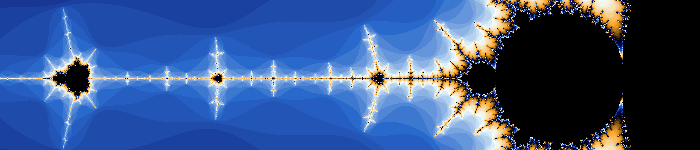

# FractalJS

Explore the [Mandelbrot set](https://en.wikipedia.org/wiki/Mandelbrot_set) right in your browser. Try it out by clicking the banner above.

### Some nice places to visit in the Mandelbrot set 

* [Mini Mandelbrot](http://solendil.github.io/fractaljs/#AAQA*AgAAAABAP+Wpp3O7vyrLehP8xO6*9V3GYVaAQj8_)
* [Spiral](http://solendil.github.io/fractaljs/#AAQB*AQAAAABVfFMtrB7pvzZz8FMtw8K*EgCFBmlETz8_)
* [Lightning](http://solendil.github.io/fractaljs/#AAQBLAAAAAABak2fL7lP0v2qO+hJfqda*j4+bSQ2YnT8_)
* [Cat's eye](http://solendil.github.io/fractaljs/#AAQBfAwAAAAAc+4EF7dPSP1q02Z9WYY6*6UN7vifqCz8_)

### Project goals

* To be a realtime fractal explorer working right in the browser
* To become reasonably complete while remaining dead simple to use
* To be a platform to share places and pictures of fractal sets
* To be a showcase for the power of Javascript and Web technologies

Help is welcome!

### Compatibility

FractalJS has been tested with:
* latest Chrome
* latest Firefox
* Safari for Mac
* IE >11

# Technical details

### Dependencies

FractalJS depends on [jQuery](https://jquery.com/) and [RequireJS](http://requirejs.org/).

### Build system

FractalJS is designed as a no-setup project. You can just download it, open /app/index.html in your browser and start editing the javascript. 

There is a build system however, based on [Grunt](http://gruntjs.com/), providing:
* auto-reload
* [JSHint](http://jshint.com/) code quality
* [RequireJS](http://requirejs.org/) optimization and minification

